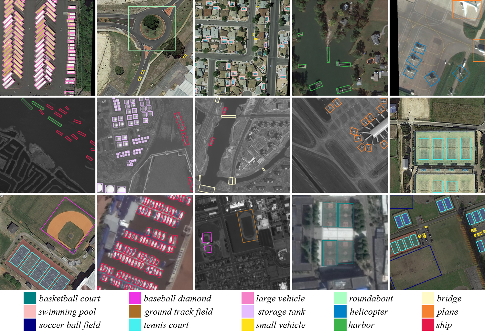

# AIDet (Object Detection in Aerial Images)

## Introduction

AIDet is an open source object detection in aerial image toolbox based on [MMDetection](https://github.com/open-mmlab/mmdetection).



### Major features

- **Different Oriented Bounding Box Encoding Methods**

We encode oriented bounding box to `Mask OBB, Theta-based OBB, Point-based OBB, H-based OBB, and CenterMap OBB`

## License

This project is released under the [Apache 2.0 license](LICENSE).

## Support methods

- [x] [Theta-based OBB]()
- [x] [Point-based OBB]()
- [x] [H-based OBB]()
- [x] [CenterMap OBB]()
- [x] [Mask OBB]()


## Installation

Please refer to [INSTALL.md](docs/INSTALL.md) for installation and dataset preparation.


## Get Started

Please see [GETTING_STARTED.md](docs/GETTING_STARTED.md) for the basic usage of MMDetection.

## Contributing

We appreciate all contributions to improve MMDetection. Please refer to [CONTRIBUTING.md](.github/CONTRIBUTING.md) for the contributing guideline.

<!-- ## Citation

If you use this toolbox or benchmark in your research, please cite this project.

```
@article{maskobb,
  title   = {Mask OBB: A Semantic Attention-Based Mask Oriented Bounding Box Representation for Multi-Category Object Detection in Aerial Images},
  author  = {Wang, Jinwang and Ding, Jian and Guo, Haowen and Cheng, Wensheng and Pan, Ting and Yang, Wen},
  journal= {Remote Sensing},
  year={2019}
}
@article{mmdetection,
  title   = {{MMDetection}: Open MMLab Detection Toolbox and Benchmark},
  author  = {Chen, Kai and Wang, Jiaqi and Pang, Jiangmiao and Cao, Yuhang and
             Xiong, Yu and Li, Xiaoxiao and Sun, Shuyang and Feng, Wansen and
             Liu, Ziwei and Xu, Jiarui and Zhang, Zheng and Cheng, Dazhi and
             Zhu, Chenchen and Cheng, Tianheng and Zhao, Qijie and Li, Buyu and
             Lu, Xin and Zhu, Rui and Wu, Yue and Dai, Jifeng and Wang, Jingdong
             and Shi, Jianping and Ouyang, Wanli and Loy, Chen Change and Lin, Dahua},
  journal= {arXiv preprint arXiv:1906.07155},
  year={2019}
}
``` -->


## Contact

This repo is currently maintained by Jinwang Wang ([@jwwangchn](http://github.com/jwwangchn)).
